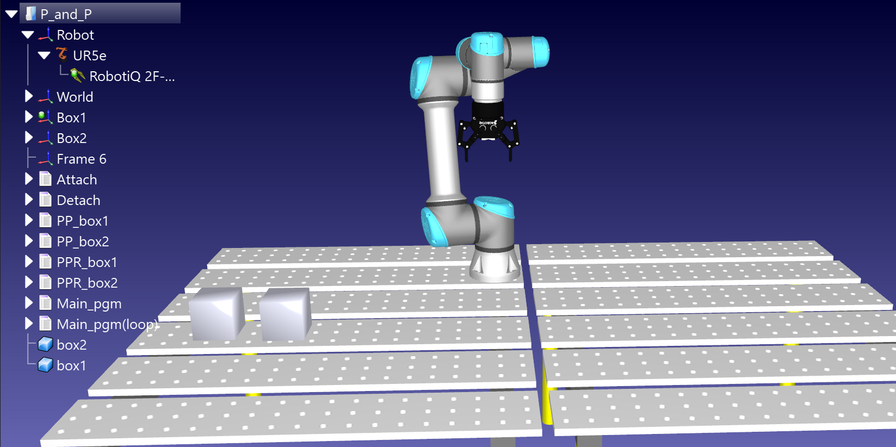
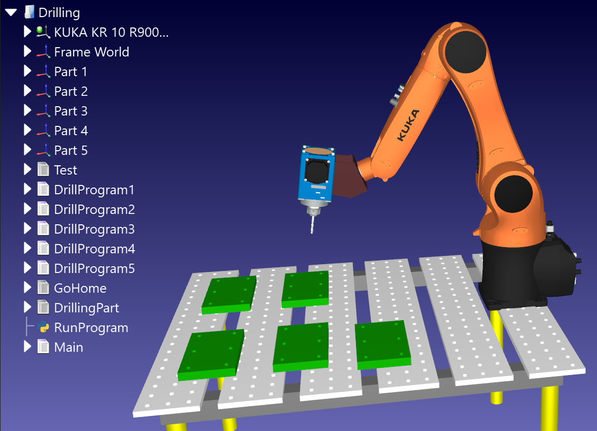

# RoboDK Project: Pick and Place & Drilling

This repository contains two RoboDK simulation projects showcasing robotic operations.

## Project Details

### 1. **Pick and Place**
- **Description**: A simulation of a robotic arm performing pick-and-place operations.
- **Setup**:
  
- **Video**: [pick_and_place_operation.mp4](pick_and_place_operation.mp4)
- **File**: [pick_and_place.rdk](pick_and_place.rdk)

### 2. **Drilling**
- **Description**: A simulation of a robotic arm performing drilling operations on predefined positions.
- **Setup**:
  
- **Video**: [drilling_operation.mp4](drilling_operation.mp4)
- **Video**: [drilling.rdk](drilling.rdk)

## How to Run

### Pick and Place Operation
1. Open the `pick_and_place.rdk` file in RoboDK software.
2. There are two main programs:
   - **Main_pgm**: Executes the pick-and-place operation once and returns the robot to its original position.
   - **Main_pgm(loop)**: Executes the pick-and-place operation continuously in an infinite loop.

### Drilling Operation
1. Open the `drilling.rdk` file in RoboDK software.
2. There are several programs for drilling:
   - **DrillProgram1** to **DrillProgram5**: Each program drills an individual material.
   - **Main Program**: Executes all drilling operations sequentially using a series of callback functions.
   - **GoHome Program**: Moves the robot to its home position after completing the operations.

## File List
- Simulation Files:
  - `pick_and_place.rdk`
  - `drilling.rdk`
- Images:
  - `pick_and_place_setup.png`
  - `drilling_setup.png`
- Videos:
  - `pick_and_place_operation.mp4`
  - `drilling_operation.mp4`

---

Uploaded on March 22, 2025.
